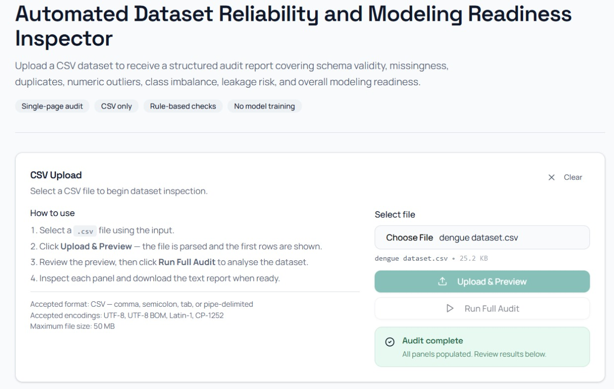
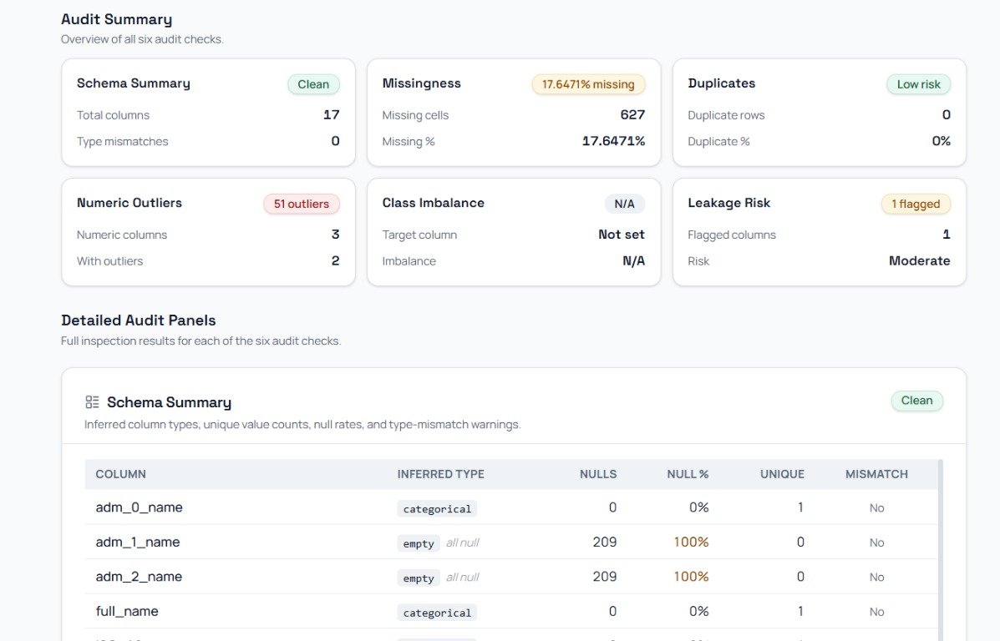
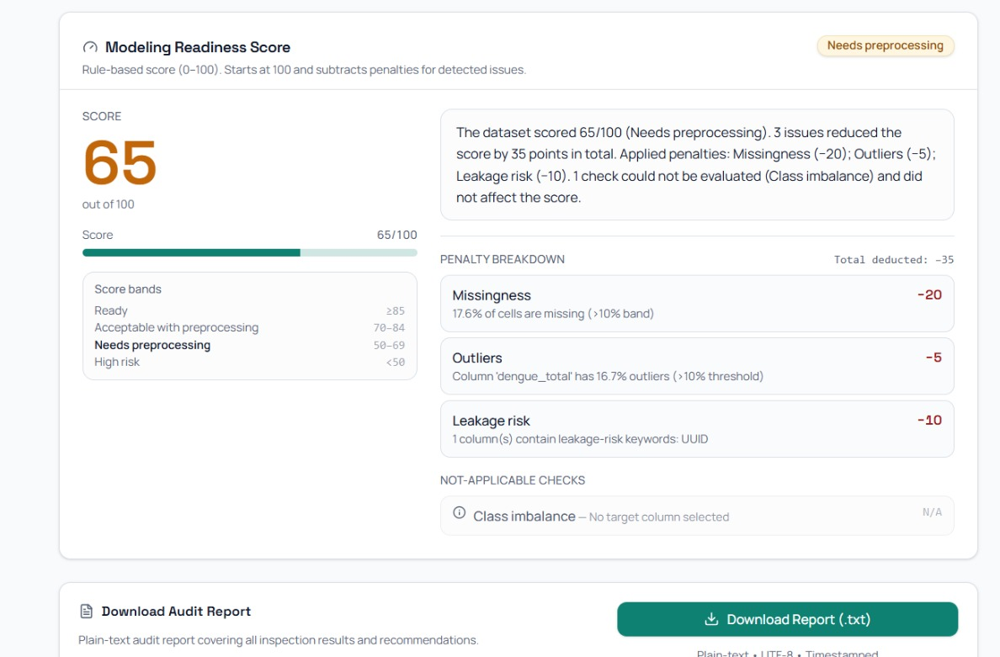

# Automated Dataset Reliability and Modeling Readiness Inspector

**Author:** Meherab Hossain Shafin  
**Project Type:** Deterministic Dataset Validation System for Machine Learning Readiness Assessment  
**Architecture:** Python Audit Engine + React Single-Page Interface  
**Scope:** Rule-based dataset integrity diagnostics with transparent readiness scoring

---

## Overview

The **Automated Dataset Reliability and Modeling Readiness Inspector** is a deterministic dataset auditing system designed to evaluate structural integrity and predictive modeling suitability prior to statistical analysis or machine learning experimentation.

The system accepts a CSV dataset as input and produces a structured audit covering schema validity, completeness, anomalies, leakage signals, and modeling readiness using transparent rule-based diagnostics.

Unlike exploratory notebooks or visualization dashboards, this tool functions as a reusable **pre-modeling validation layer** that supports reproducible data science workflows.

---

## Core Capabilities

The system performs automated dataset inspection across multiple reliability dimensions:

- **Schema diagnostics** and datatype inference
- **Dataset completeness analysis** (missingness profiling)
- **Exact duplicate row detection**
- **Numeric outlier identification** using IQR methodology
- **Leakage-risk keyword detection**
- **Target-column imbalance diagnostics** (when specified)
- **Deterministic modeling readiness scoring** (0–100)
- **Structured plain-text audit report** generation

All checks are deterministic and interpretable. No machine learning models are used for scoring.

---

## Example Demonstration Dataset

The system has been evaluated using a real epidemiological dengue surveillance dataset to demonstrate robustness under partially incomplete administrative metadata conditions.

**Observed audit findings:**

- **17.6%** dataset-wide missingness
- **Three columns** completely empty (100% null)
- **Numeric outliers** detected in `dengue_total`
- **Leakage-risk column** detected (`UUID`)
- **No duplicate rows** detected
- **Final readiness score:** **65 / 100 (Needs preprocessing)**

**Example dataset:** `example/dengue dataset.csv`  
**Generated audit report:** `example/audit_report (2).txt`

---

## Interface Demonstration

### CSV Upload and Dataset Preview
Demonstrates structured CSV ingestion and preview pipeline prior to audit execution.


---

### Audit Summary Panel
Provides a consolidated overview of dataset diagnostics across six inspection dimensions.


---

### Modeling Readiness Score
Displays transparent penalty attribution with interpretable scoring logic.


---

## Modeling Readiness Scoring Framework

The readiness scoring system begins with:
**score = 100**

Penalties are applied deterministically across the following reliability dimensions:

| Dimension | Purpose |
| :--- | :--- |
| **Schema Quality** | Structural dataset validation |
| **Missingness** | Completeness evaluation |
| **Duplicates** | Sampling integrity verification |
| **Datatype Integrity** | Parsing consistency |
| **Outliers** | Distribution stability inspection |
| **Class Imbalance** | Target distribution fairness |
| **Leakage Signals** | Target contamination risk |

**Score interpretation bands:**

| Score Range | Interpretation |
| :--- | :--- |
| **≥ 85** | Ready |
| **70–84** | Acceptable with preprocessing |
| **50–69** | Needs preprocessing |
| **< 50** | High risk |

---

## Leakage-Risk Detection Logic

Columns are flagged using deterministic substring heuristics if their names contain indicators such as:
`completed`, `discharge`, `final`, `future`, `id`, `label`, `outcome`, `post`, `prediction`, `result`, `status`, `target`.

Identifier-style variables (e.g., UUID) are flagged because they may introduce record-level leakage or non-generalizable signals if retained during predictive modeling workflows.

---

## Outlier Detection Methodology

Numeric anomaly detection is implemented using the **Interquartile Range (IQR)** method:
- $IQR = Q3 - Q1$
- $Lower Bound = Q1 - 1.5 \times IQR$
- $Upper Bound = Q3 + 1.5 \times IQR$

Columns exceeding a 10% outlier rate trigger readiness penalties.

---

## Generated Audit Report Structure

Each dataset audit produces a structured plain-text report containing:

1. **DATASET OVERVIEW**
2. **SCHEMA DIAGNOSTICS**
3. **MISSINGNESS SUMMARY**
4. **DUPLICATE ANALYSIS**
5. **NUMERIC OUTLIER SUMMARY**
6. **CLASS IMBALANCE SUMMARY**
7. **LEAKAGE-RISK INDICATORS**
8. **MODELING READINESS SCORE**
9. **RECOMMENDATIONS**

Reports are designed for portability and reproducibility across modeling environments.

---

## Repository Structure

```text
backend/
├── audit_engine.py
├── server.py
└── requirements.txt
frontend/
├── src/
├── public/
├── package.json
├── tailwind.config.js
└── craco.config.js
docs/
├── upload_preview.jpeg
├── audit_summary.jpeg
└── model_readiness.png.jpeg
example/
├── dengue dataset.csv
└── audit_report (2).txt
tests/
README.md
```
## Reproducibility Instructions

To reproduce the demonstration audit and verify system determinism:

1. **Upload:** Navigate to the upload interface and select `example/dengue dataset.csv`.
2. **Execute:** Run the dataset audit to trigger the diagnostic pipeline.
3. **Verify:** Compare the generated output with the reference file: `example/audit_report (2).txt`.

---

## Technology Stack

### Backend
- **Language:** Python
- **Engine:** Deterministic rule-based statistical diagnostics
- **Output:** Structured audit report generator

### Frontend
- **Framework:** React
- **Styling:** TailwindCSS
- **Interface:** Single-page inspection (SPA) architecture

### Architecture
`CSV` → `Parser` → `Audit Engine` → `Scoring Engine` → `Report Generator`

---

## Design Constraints (Intentional MVP Scope Control)

To ensure maximum transparency, interpretability, and deterministic reproducibility, the system intentionally excludes:

- **Authentication Systems:** No user login requirements to ensure immediate utility.
- **Database Persistence:** Operates as a stateless service to protect data privacy.
- **Excel Ingestion:** Strictly optimized for CSV structures.
- **PDF Export:** Prioritizes machine-readable and portable plain-text reporting.
- **Cloud Storage Integration:** Eliminates external dependencies and egress risks.
- **ML-Based Scoring:** Avoids "black-box" weights; all penalties are rule-derived.
- **Fuzzy Matching Heuristics:** Maintains strict data integrity standards.
- **Workflow Automation:** Focuses purely on diagnostic auditing rather than remediation.

---

## Intended Applications

This tool serves as a reusable validation framework for high-stakes data environments:

* **Machine Learning Pipelines:** Pre-modeling data quality gatekeeping.
* **Epidemiological Research:** Validating surveillance datasets (e.g., Dengue/Public Health).
* **Forecasting Workflows:** Ensuring temporal and structural consistency in time-series data.
* **Statistical Auditing:** Verifying tabular research datasets prior to peer review.
* **Data Governance:** Standardizing reproducible quality-screening protocols.

---

## Author

**Meherab Hossain Shafin** *Designed and implemented as a deterministic dataset validation subsystem supporting reproducible pre-modeling reliability assessment workflows.*
